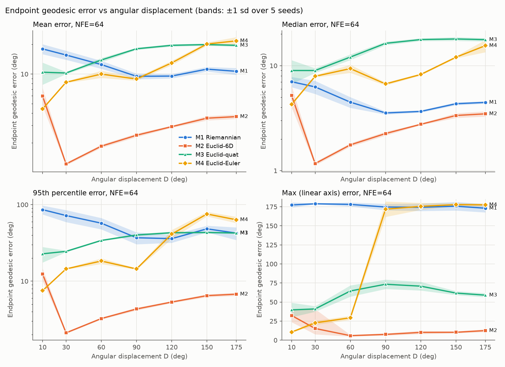
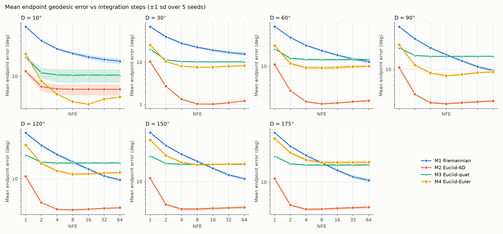
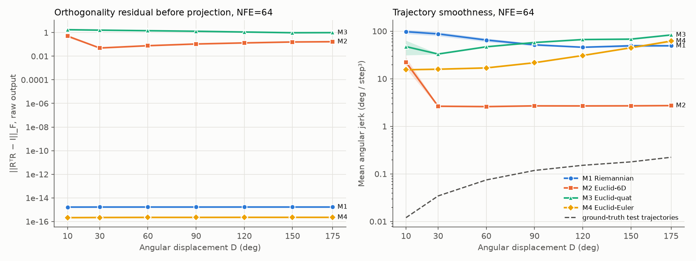

# FINDINGS — SE(3) flow matching, Night 1

_Status: complete. 140/140 main runs, 0 failures. Every headline number is mean ± sd over 5 seeds (0–4).
Headline NFE = 64. Tables: `results/summary_tables.md`; all numbers: `results/summary.json`;
figures: `results/figures/`._

## The answer

**Euclidean flow matching with the 6D representation (M2) does not merely match Riemannian flow
matching (M1). It beats it at every angular displacement from 10° to 175°**, on every error statistic,
at every NFE:
- Mean endpoint error: M2 1.2–6.0° vs M1 9.5–18.0°. The seed-paired gap is −6.6 to −14.4°, which is
  7–19 pooled seed-sd. Holm-adjusted p ≤ 8e-4 at every D.
- Worst case: M2's max error is ≤ 32°, and ≤ 12.6° for D ≥ 60. M1 produces a > 45° error in 4–10% of
  samples at every D, with max ≈ 175°.
- No crossover exists. None of 10,000 seed-bootstrap resamples shows M1 overtaking M2 anywhere on the grid.

**Gate: none of the three pre-registered outcomes occurred as written.** The closest is outcome 1
(H2 supported strongly), in a stronger form: M2 doesn't track M1 within seed noise, it is clearly better.
Taken literally, the gate says night 2 should test H2 on real robot data. First, though, read "What broke"
§1: M1's deficit comes almost entirely from one mechanism (the Haar prior meeting the SO(3) cut locus),
and a different prior could change the M1 picture. That is a decision for you before night 2.

The parameterization flips the conclusion. Against the parameterizations published baselines typically use,
M1 does win, above a crossover angle:
- vs **M3 (quaternion): crossover at 54° [95% CI 50–59]**;
- vs **M4 (XYZ Euler): crossover at 94° [92–98]**, which lines up with the gimbal-lock onset measured in the data.

(Crossovers use a seed-paired bootstrap with 10k resamples and linear interpolation between grid levels,
`results/crossover.json`. The CI reflects seed variance only. The 30° grid spacing and the linear
interpolation are the larger, unquantified uncertainty.)

A "Riemannian beats Euclidean" result on large-rotation tasks is therefore reproducible here, but only
against quaternion or Euler baselines. With 6D the sign reverses. That supports H2 (the published
advantage is substantially a parameterization artifact).

Scope, stated plainly: this is a synthetic task, a joint-trajectory MLP at width 1024 (not the specified 256;
see Deviations), a 20k-step budget, and a Haar source distribution. The claims don't extend beyond that
without night-2 evidence.

## DEVIATIONS FROM THE NIGHT-1 SPEC (read first)

1. **Network width is 1024, not 256. Applied identically to all four models.**
   The specified MLP (4 × 256, SiLU; 0.30–0.35M params) cannot fit this task for *any* parameterization.
   At D=90 on the val split (LR 1e-3, NFE=32), mean endpoint error after 5k / 15k / 30k steps was:
   M1 126 / 126 / 126° (exactly the Haar-chance mean, π/2 + 2/π rad); M2 67 / 63 / 61°; M3 79 / 73 / 69°; M4 39 / 36 / 34°.
   Generated-path angular jerk was ~150–300°/step³ against a ground truth of 0.12.
   Cause: the velocity target `(x1(c) − x_t)/(1−t)` requires a time-gated pass-through of the whole
   32-waypoint state (192–384 dims) through a 256-wide network. How badly that fails depends on the state
   dimension of each representation, so a 256-wide comparison measures capacity, not geometry.
   Capacity diagnostic (10k steps, D=90) — mean val error:

   | width (params) | M1 | M2 | M3 | M4 |
   |---|---|---|---|---|
   | 256 (0.30–0.35M), 15k steps | 126.2* | 62.7 | 72.9 | 36.0 |
   | 512 (0.99–1.19M) | 23.7 | 45.1 | 60.6 | 33.4 |
   | 1024 (3.56–3.95M) | 17.8 | 13.4 | 20.4 | 7.6 |

   (*superseded M1 output head, see deviation 2.) The model ranking flips between 512 and 1024, so any
   narrower network would decide the answer by capacity. Width 1024 (3.6–3.9M params) exceeds CLAUDE.md's
   "<1M params" description. It is still a CPU-trainable MLP (~11 min per run), not GPU-cluster scale.
   Record: `results/budget.json`.
2. **M1 output head: tangent projection of an ambient output (Chen & Lipman 2023 RFM recipe).**
   My first M1 had the MLP emit the body-frame tangent vector directly. That target,
   `log(R_tᵀ R1)/(1−t)`, forces the network to learn a multiplication by its own input `R_tᵀ`.
   The model stayed at chance at every width tried (126° at 256, 122° at 1024). The final M1 emits an
   ambient 3×3 matrix A per waypoint, and the velocity is its analytic projection onto T_R SO(3):
   Ω = vee(Rᵀ A). This is the standard vector-field parameterization for an embedded manifold. The velocity
   still lives in the tangent space, the path is still the geodesic, and integration is still an exp-map
   step. No Euclidean model needs an analogue: their velocities are already in fixed coordinates.
   Oracle tests (`tests/test_flows.py`) pass for both heads. The fix changes how the network represents M1's
   vector field, not M1's geometry. It was found by inspecting M1's failure, so it is reported here rather
   than folded in silently.
3. **Step budget: 20k steps, set by wall clock, not by convergence.** The same for all models.
   Loss was still decreasing at 20k in the diagnostics. The numbers below describe a fixed, equal training
   budget, not converged models.
4. **Task design choices the spec left open** (see "Setup" below). Start poses are near identity, and the
   target is a deterministic function of the start, so "error to the ground-truth endpoint" is defined for a
   start-conditioned model. All four models share the same source distribution: Haar rotations encoded into
   each representation.

## Setup

**Task (Stage 1, `src/make_data.py`).** For each D ∈ {10, 30, 60, 90, 120, 150, 175}°, there are 2000 trajectories
of 32 SE(3) waypoints, split 1600/200/200. Each trajectory is built as follows:
- axis a ~ Uniform(S²), start tilt σ ~ U[10°, 20°];
- start R0 = exp(σa), p0 ~ N(0, 0.1²I);
- target R1 = R0·exp(D·a), p1 = p0 + 0.3·a.

So d(R0, R1) = D exactly (checked to 1e-13), |p1 − p0| = 0.3 exactly, and the target is a deterministic
function of the start: the axis can be read off R0.

Path types come in equal thirds (667/667/666), all with minimum-jerk timing:
- geodesic screw motion `g0·se3_exp(s·se3_log(g0⁻¹g1))`;
- via-point detour: a sin²(πτ) bump of U[0.15, 0.30]·D rotation and U[0.15, 0.30]·0.3 translation, perpendicular to a;
- rotational overshoot of U[10, 25]% of D before settling.

Data are stored as float64 rotation matrices (max orthogonality residual 3.8e-15).

Why starts near identity: the discontinuities Zhou et al. describe sit at fixed places relative to identity.
The canonical-quaternion hemisphere boundary is at 180° from identity, and XYZ Euler gimbal lock is at a
middle angle of ±90°. With starts near identity, D controls how close the data comes to those singularities,
which is the boundary this night set out to measure. Measured exposure (`results/synthetic/D*_meta.json`):

| D | max angle from I | traj. with canonical-quat sign flip | traj. with Euler jump > 90° | endpoints with quat w < 0.1 |
|---|---|---|---|---|
| 10 | 32° | 0% | 0% | 0% |
| 30 | 57° | 0% | 0% | 0% |
| 60 | 94° | 0% | 0% | 0% |
| 90 | 132° | 0% | 3.4% | 0% |
| 120 | 169° | 0% | 14.4% | 0% |
| 150 | 180° | 31.2% | 42.7% | 13.9% |
| 175 | 180° | 100% | 74.9% | 64.8% |

This is the favorable case for quaternions and Euler angles at small D (data near identity, as in many robot
tasks). With Haar-uniform starts, every D would already straddle the singularities.

**Models (Stage 2, `src/flows.py`, `src/fm.py`).** Conditional flow matching with velocity prediction.
The following are **identical for all four**:
- MLP, 4 hidden layers × 1024, SiLU (see Deviations);
- Adam with 500-step linear warmup, then cosine decay to 0;
- batch 256, 20k steps, gradient clip 1.0;
- conditioning: flattened R0 (9) plus p0/0.3 (3), and the raw scalar t;
- source: Haar-uniform rotation per waypoint, encoded into each representation, and N(0, I) translations (in units of 0.3);
- translation is Euclidean with the straight-line path in every model;
- per seed, the same minibatch indices, t values and source samples: "common random numbers" across models.

Only the rotation state, path and ODE step differ:
- M1: state on SO(3), geodesic path, tangent-projected velocity, exp-map step.
- M2: 6D, straight line, Euler step, Gram-Schmidt at the end.
- M3: canonical quaternion, straight line, normalize at the end.
- M4: XYZ Euler, straight line.

M2–M4 are never re-projected mid-integration.

Parameter counts: M1 3,949,952; M2 3,753,248; M3 3,622,112; M4 3,556,544. Hidden layers are identical;
the differences come only from representation-dependent input and output widths.

**Tuning (identical protocol).**
- Base LR grid {3e-4, 1e-3, 3e-3}, for every model, at D ∈ {30, 90, 150}, with tuning seed 100 (disjoint
  from the evaluation seeds 0–4).
- Per-model LR minimizes mean val endpoint error at NFE=32, averaged over the three D values.
- The base picks landed on grid edges for all four models (M1–M3 at 3e-3, M4 at 3e-4). A rule I registered
  *before* selection ran therefore extended the grid by one step on both sides, 1e-4 and 1e-2, for ALL models.
  The final optima are interior for every model.
- Log: `results/hparams.json`.

Val mean error (deg), averaged over D = 30/90/150:

| LR | M1 | M2 | M3 | M4 |
|---|---|---|---|---|
| 1e-4 | 22.8 | 16.4 | 24.5 | 21.7 |
| 3e-4 | 16.4 | 6.2 | 21.8 | **11.0** |
| 1e-3 | 13.5 | 4.2 | 17.0 | 11.1 |
| 3e-3 | **12.9** | **2.1** | **14.4** | 29.0 |
| 1e-2 | 60.0 | 114.3 | 113.5 | 119.1 |

Selected LRs: M1, M2, M3 at 3e-3; M4 at 3e-4. All other hyperparameters were fixed and shared. No other
search was run for any model.

**Measurement (Stage 3).** For each of 4 models × 7 D × 5 seeds, draw 5 samples for each of the 200 test
starts (1000 trajectories). The source samples are identical across models per (D, seed).
- NFE ∈ {1, 2, 4, 8, 16, 32, 64}.
- Metrics:
  - geodesic endpoint error (mean, median, p95, max);
  - orthogonality residual of the RAW final state before projection;
  - mean angular jerk ‖Δ²ω‖ with ω_k = log(R_kᵀR_{k+1});
  - translation endpoint error.
- A non-finite output would be counted as 180° (none occurred; see tables).
- Raw-state residual definitions:
  - M1: the state itself;
  - M2: [a1, a2, a1×a2];
  - M3: the homogeneous quaternion matrix |q|²R(q̂), so the residual is √3·| |q|⁴ − 1 |;
  - M4: Euler angles map to an exact rotation by construction, so its residual is structurally ~1e-16 and uninformative.

## Results (test split, 1000 trajectories per run, NFE=64, mean ± sd over 5 seeds)



**Mean endpoint geodesic error (deg)**

| Model | D=10 | D=30 | D=60 | D=90 | D=120 | D=150 | D=175 |
|---|---|---|---|---|---|---|---|
| M1 Riemannian | 18.03 ± 2.09 | 15.63 ± 1.65 | 12.49 ± 1.16 | 9.49 ± 0.63 | 9.54 ± 0.50 | 11.22 ± 0.60 | 10.67 ± 0.85 |
| M2 Euclid-6D | 5.96 ± 1.26 | 1.22 ± 0.04 | 1.85 ± 0.07 | 2.38 ± 0.10 | 2.92 ± 0.08 | 3.56 ± 0.18 | 3.69 ± 0.19 |
| M3 Euclid-quat | 10.44 ± 2.64 | 10.26 ± 0.27 | 13.89 ± 0.69 | 18.08 ± 0.47 | 19.61 ± 0.58 | 19.95 ± 0.54 | 19.60 ± 0.61 |
| M4 Euclid-Euler | 4.41 ± 0.05 | 8.25 ± 0.14 | 9.99 ± 0.85 | 8.90 ± 0.34 | 13.00 ± 0.67 | 20.22 ± 0.80 | 21.76 ± 2.01 |

**Median / 95th percentile / max (deg)**

| Model | stat | D=10 | D=30 | D=60 | D=90 | D=120 | D=150 | D=175 |
|---|---|---|---|---|---|---|---|---|
| M1 | median | 7.0 ± 0.8 | 6.3 ± 0.9 | 4.5 ± 0.5 | 3.6 ± 0.1 | 3.7 ± 0.1 | 4.3 ± 0.1 | 4.5 ± 0.1 |
| M2 | median | 5.2 ± 1.2 | 1.2 ± 0.0 | 1.8 ± 0.1 | 2.3 ± 0.1 | 2.8 ± 0.1 | 3.4 ± 0.2 | 3.5 ± 0.2 |
| M3 | median | 9.0 ± 2.3 | 9.0 ± 0.5 | 12.1 ± 0.7 | 16.3 ± 0.6 | 17.7 ± 0.6 | 18.0 ± 0.8 | 17.7 ± 0.6 |
| M4 | median | 4.3 ± 0.1 | 7.9 ± 0.2 | 9.4 ± 0.8 | 6.7 ± 0.2 | 8.3 ± 0.2 | 12.0 ± 0.3 | 15.5 ± 2.1 |
| M1 | p95 | 86.0 ± 11.4 | 72.1 ± 12.8 | 57.3 ± 9.7 | 36.9 ± 6.6 | 36.0 ± 4.2 | 48.3 ± 4.9 | 42.5 ± 8.0 |
| M2 | p95 | 12.4 ± 2.3 | 2.1 ± 0.1 | 3.3 ± 0.1 | 4.3 ± 0.2 | 5.3 ± 0.2 | 6.5 ± 0.3 | 6.8 ± 0.3 |
| M3 | p95 | 22.8 ± 5.2 | 24.5 ± 0.6 | 34.1 ± 0.7 | 40.2 ± 1.4 | 43.0 ± 1.6 | 43.3 ± 1.3 | 42.6 ± 1.1 |
| M4 | p95 | 7.5 ± 0.1 | 14.5 ± 0.3 | 18.3 ± 1.6 | 14.5 ± 0.3 | 41.2 ± 5.5 | 75.5 ± 5.2 | 63.5 ± 6.0 |
| M1 | max | 177 ± 3 | 179 ± 1 | 178 ± 3 | 175 ± 4 | 174 ± 5 | 176 ± 6 | 173 ± 5 |
| M2 | max | 32 ± 9 | 15 ± 25 | 5.9 ± 1.1 | 7.6 ± 1.5 | 10.2 ± 2.1 | 10.3 ± 1.3 | 12.6 ± 1.8 |
| M3 | max | 40 ± 9 | 41 ± 4 | 65 ± 7 | 73 ± 6 | 71 ± 6 | 62 ± 3 | 59 ± 3 |
| M4 | max | 10.6 ± 0.7 | 22.7 ± 2.7 | 29.4 ± 2.7 | **172 ± 10** | 176 ± 5 | 178 ± 2 | 178 ± 2 |

**Fraction of samples with error > 45°**

| Model | D=10 | D=30 | D=60 | D=90 | D=120 | D=150 | D=175 |
|---|---|---|---|---|---|---|---|
| M1 | 0.098 ± 0.015 | 0.084 ± 0.013 | 0.063 ± 0.009 | 0.041 ± 0.008 | 0.042 ± 0.004 | 0.055 ± 0.006 | 0.045 ± 0.008 |
| M2 | 0 | 0 | 0 | 0 | 0 | 0 | 0 |
| M3 | 0.000 | 0.000 | 0.013 ± 0.003 | 0.027 ± 0.002 | 0.040 ± 0.008 | 0.039 ± 0.009 | 0.036 ± 0.010 |
| M4 | 0 | 0 | 0 | 0.017 ± 0.002 | 0.047 ± 0.006 | 0.089 ± 0.008 | 0.075 ± 0.009 |

**Seed-paired difference vs M1, mean error (deg): diff [95% CI], Holm p, |diff|/pooled seed sd**

| vs M1 | D=10 | D=30 | D=60 | D=90 | D=120 | D=150 | D=175 |
|---|---|---|---|---|---|---|---|
| M2 | −12.1 [−15.7, −8.4] p=8e-4 (7.0) | −14.4 [−16.5, −12.4] p=1e-4 (12.4) | −10.7 [−12.1, −9.3] p=1e-4 (13.0) | −7.1 [−7.9, −6.3] p=7e-5 (15.7) | −6.6 [−7.2, −6.0] p=5e-5 (18.6) | −7.7 [−8.4, −6.9] p=6e-5 (17.2) | −7.0 [−8.0, −6.0] p=1e-4 (11.3) |
| M3 | −7.6 [−10.2, −5.0] p=.004 | −5.4 [−7.3, −3.5] p=.004 | +1.4 [−0.4, +3.2] p=.10 | +8.6 [+7.8, +9.4] p=4e-5 | +10.1 [+9.1, +11.1] p=4e-5 | +8.7 [+7.9, +9.5] p=4e-5 | +8.9 [+8.3, +9.5] p=1e-5 |
| M4 | −13.6 [−16.2, −11.0] p=8e-4 | −7.4 [−9.4, −5.3] p=.002 | −2.5 [−4.9, −0.1] p=.09 | −0.6 [−1.3, +0.1] p=.09 | +3.5 [+2.4, +4.5] p=.002 | +9.0 [+7.9, +10.1] p=2e-4 | +11.1 [+8.3, +13.9] p=.002 |

(Negative means lower error than M1. Pairing: each seed shares data, minibatch order, t values, and training
and evaluation source samples across models. n=5 per cell.)

## Answers

**1. Does M2 match M1 across the sweep? Where do they separate?**
No. M2 is better than M1 at every D. At D=10 the gap is 7.0 pooled seed-sd; at D=90–150 it is 15.7–18.6 sd.
There is no separation point: they are separated at every level in the same direction (M2 better), and the
bootstrap finds no crossover. The gap is smallest in relative terms on the median at large D
(D ≥ 90: M1 3.6–4.5° vs M2 2.3–3.5°, a ratio of 1.3–1.6×). It is largest in the tail (see Q3).

**2. How much worse are M3 and M4? Is the M1-vs-M3/M4 gap larger than the M1-vs-M2 gap?**
- M2 beats M3 and M4 at every D except D=10, where M4 is best (4.4° vs M2's 6.0°; see "What broke" §4).
- Against M1, the sign of the M3/M4 gap depends on D. M3 has lower mean error than M1 below ~54°
  (significant at D ≤ 30) and is worse above it, by 8.6–10.1° at D ≥ 90. M4 is lower below ~94°
  (significant at D ≤ 30) and worse above it, by 3.5–11.1° at D ≥ 120.
- Above those angles, M1 beats M3/M4 by 7–11°, while at the same angles M2 beats M1 by 7–8°.
- So "is the gap larger?" is really "does the sign flip?", and it does. A study comparing M1 to quaternion
  or Euler baselines at D ≳ 90° would report a clear Riemannian win (up to 11°, 7–19 seed-sd). With 6D,
  the same comparison reports a clear Riemannian loss. **This supports H2.**
- Zhou's discontinuity mechanism is visible for Euler: M4's max error jumps from 29° (D=60) to 172° (D=90),
  exactly where the data first crosses Euler jumps (3.4% of trajectories at D=90, 0% at D=60).
- For quaternions it is *not* visible as a step. M3 degrades smoothly (median 9° → 18° from D=30 to D=120,
  then flat) and does not break at D=150/175, where the canonical-sign flips first appear (31% and 100% of
  trajectories). M3's errors are elevated at every D, including D ≤ 60 where no flips exist. So its deficit
  here is not mainly the hemisphere discontinuity in the data. I don't have a verified mechanism for it
  (see "What broke" §5).

**3. Do the 95th-percentile and max tell a different story from the means?**
Yes, sharply.
- M1's mean is inflated by a catastrophic tail: p95 36–86°, max ≈ 175° at every D, and 4–10% of samples
  above 45°. M1's median is much closer to M2's. The tail mechanism is diagnosed in "What broke" §1.
- M2 has no tail: p95 ≤ 12.4° and max ≤ 32° at every D (≤ 12.6° for D ≥ 60).
- M4's mean hides its phase change. Mean error at D=90 (8.9°) is *better* than M1's, yet its max error there
  is already 172°. The mean alone would put the Euler failure at ~120°; the max puts it at 90°.
- M3's max is 40–73° with a small > 45° fraction (≤ 4%).
- Ranked by worst case: M2 ≪ M3 < M1 ≈ M4 (D ≥ 90).

**4. Does the NFE curve change the ranking? Does M1 win at low NFE even where it ties at high NFE?**
No. It goes the other way: M1 is *worst* at low NFE.



- At NFE=1, M1's mean error is 69–71° at every D; M2's is 10–11°. At NFE=4: M1 26–30°, M2 1.3–6.1°.
- M2 plateaus by NFE 4–8 and drifts up slightly after that (D=30: 1.0° at NFE 8–16 → 1.2° at 64).
- M1 improves monotonically and is **still improving at NFE=64** (D=175: 12.3° → 10.7° from 32 to 64).
  So M1 is the model that needs *more* steps here, the opposite of the "fewer integration steps" claim.
- M2 ranks first in every (D, NFE) cell except D=10, where M4 leads at NFE ≥ 4. M1 ranks last at NFE ≤ 4
  for every D, and rises to second only at NFE ≥ 16–32 for D ≥ 120.
- Caveat: M1 might close more of the gap at NFE > 64. That was not measured.

**5. What broke.** See the next section.

**Secondary measurements (NFE=64)**



| Measurement | M1 | M2 | M3 | M4 | ground truth |
|---|---|---|---|---|---|
| Raw orthogonality residual ‖RᵀR−I‖_F, mean over waypoints | 1.7e-15 (max 4.9e-15) | 0.05–0.17 (0.51 at D=10); max 0.6–4.8 | 0.97–1.8; max 10–32 | 2.2e-16 (structural) | — |
| Mean angular jerk (deg/step³) | 46–97 | 2.6–2.7 (22 at D=10) | 33–83 | 15–62 | 0.01–0.22 |
| Translation endpoint error (m) | 0.017–0.093 | 0.008 | 0.010–0.012 | 0.028–0.075 | — |

- **Orthogonality.** M1's exp-map integration keeps the state on SO(3) to machine precision (float64), as
  designed. M2 and M3 drift far off-manifold (M3's final |q| is off by ~10–20%). But M2's large raw residual does
  *not* predict endpoint error: it is the most accurate model after Gram-Schmidt. The residual shrinks with
  NFE for M2 (0.51 at NFE=1 → 0.17 at NFE ≥ 4, D=175).
- **Smoothness.** Every model's trajectories are far rougher than the data. For D ≥ 30, M2 is 12–90× the
  ground-truth jerk (~1900× at D=10); M1 is 220–8000×. M2 is 17–33× smoother than M1 at every D ≥ 30. None of the models reproduces
  data-level smoothness under this budget, so the absolute jerk values say more about undertraining than
  about geometry.
- **Translation** is handled identically in all four models, yet its error differs by up to 10×. Rotation
  and translation share one network and one loss, so a hard rotation target degrades translation too.
  This is a real coupling confound; it is small for M2/M3 and larger for M1/M4.

**Wall-clock.** In-sweep training time (8 parallel workers on 4 performance + 6 efficiency cores, so
contended and core-type dependent), over 35 runs each: M1 876 ± 62 s, M2 800 ± 75 s, M3 823 ± 66 s,
M4 781 ± 65 s. Clean single-process timings are in the table below (`results/timing.json`).

**Clean wall-clock** (1 CPU thread, one process running alone, D=90; inference is mean ± sd over the 5 trained seeds)

| Model | train ms/step | infer ms/traj, batch 1000, NFE=4 | NFE=16 | NFE=64 | infer ms/traj, batch 1, NFE=4 | NFE=64 |
|---|---|---|---|---|---|---|
| M1 | 14.81 ± 0.12 | 0.050 ± 0.001 | 0.200 ± 0.001 | 0.798 ± 0.006 | 0.769 ± 0.047 | 12.945 ± 0.211 |
| M2 | 12.79 ± 0.03 | 0.038 ± 0.000 | 0.148 ± 0.001 | 0.596 ± 0.005 | 0.420 ± 0.083 | 6.521 ± 1.571 |
| M3 | 13.07 ± 0.08 | 0.037 ± 0.000 | 0.141 ± 0.001 | 0.564 ± 0.007 | 0.362 ± 0.061 | 4.675 ± 0.199 |
| M4 | 12.87 ± 0.07 | 0.036 ± 0.000 | 0.140 ± 0.002 | 0.555 ± 0.001 | 0.375 ± 0.084 | 5.541 ± 1.365 |

M1 costs 16% more per training step and 34% more per batched inference step (float64 log/exp on CPU), and
about 2× the single-trajectory latency. Per unit of accuracy the gap is far larger: M2 reaches ~2–3° at
NFE=4 (0.04 ms/traj batched), and M1 never gets below 9.5° at any NFE tested.

## What broke

1. **M1's catastrophic tail is the cut locus of the Haar prior (diagnosed, `results/diag_tail.json`).**
   Across all 35,000 M1 test samples (7 D × 5 seeds × 1000), endpoint error depends strongly on the initial
   geodesic distance d0 between the source sample and the target (correlation 0.47). For M2–M4 the
   correlation is ≤ 0.06.

   | d0 (deg) | n | M1 mean err | M1 frac > 45° | M2 mean err | M2 frac > 45° |
   |---|---|---|---|---|---|
   | 0–90 | 6403 | 2.5 | 0.000 | 3.0 | 0 |
   | 90–120 | 7377 | 3.4 | 0.000 | 3.1 | 0 |
   | 120–150 | 9799 | 5.2 | 0.000 | 3.1 | 0 |
   | 150–165 | 5591 | 10.3 | 0.000 | 3.1 | 0 |
   | 165–175 | 3851 | 27.0 | 0.143 | 3.1 | 0 |
   | 175–180 | 1979 | 91.7 | 0.803 | 3.1 | 0 |

   - **Every** M1 error above 45°, at every D, comes from a source sample more than 165° from its target.
   - Near 180°, `log(R0ᵀR1)` is discontinuous (the axis flips sign), so the conditional velocity field has
     a discontinuity. The MLP smooths it toward zero, and those samples stall.
   - The Haar density ∝ (1 − cos θ) puts ~16% of source samples beyond 165°.
   - With the cut locus excluded, M1 is on par with M2 (d0 < 90°: 2.5° vs 3.0°), though M1's error still
     grows with d0.
   - M2's straight line in 6D has no cut locus, which is why the same source samples cause it no trouble.

   This is a property of geodesic FM with a uniform SO(3) prior, not of the manifold per se. A prior
   concentrated away from the cut locus (e.g. an isotropic Gaussian on SO(3) around a data-dependent mean),
   or a different conditional path, might remove it. I did not test that: it would be tuning M1 beyond the
   spec, and whether it belongs in night 2 is your call.
2. **The specified architecture could not learn the task** (Deviation 1). Width 256 failed for every model
   (M1 at chance). The width at which the comparison stabilizes (~1024) is 4× the spec and 3.6–3.9M params.
3. **My first M1 head was wrong for an MLP** (Deviation 2). A direct body-frame velocity output stayed at chance.
4. **Training instability, M1 only.** At the protocol-selected LR (3e-3), 10 of 35 M1 runs had a loss spike
   (> 1.5× step-to-step). All were at D ≤ 60; one peaked at 31.9, and D=30 seed 1 ended at 3× normal loss.
   M2–M4 had 0 spikes in 105 runs. Median M1 mean error: 10.6° in runs without a spike, 15.9° in runs with one.
   - This inflates M1's small-D numbers and is part of why M1 looks *better* at larger D.
   - It does not drive the headline: at D ≥ 90 every M1 run is spike-free, and M2 still wins by 6.6–7.7°
     (15.7–18.6 sd).
   - In tuning, M1 at 1e-3 was only 0.6° worse than at 3e-3, far smaller than the M2–M1 gap.
5. **Unexplained: D=10 is harder than D=30 for M1, M2 and M3.** M2 is at 6.0 ± 1.3° vs 1.2°, with 10× the
   jerk and orthogonality residual, and all three models have large seed variance there.
   - It is not training divergence: M2 and M3 loss curves at D=10 are smooth and end near their D=30 values.
   - M4 (LR 3e-4) is the best model at D=10.
   - D=10 was not a tuning level, and its path-type variations are tiny (detours 1.5–3°, overshoots 1–2.5°),
     so the target distribution is nearly degenerate. That is an untested hypothesis, not a finding.
   - Also unexplained: M3's across-the-board deficit (Answer 2).
6. **The LR grid was edge-bound for every model on the first pass.** Handled by the pre-registered extension.
   1e-2 diverged for all four models.
7. **Not converged.** Loss was still decreasing at 20k steps, jerk is 12–8000× the data, and M1 was still
   improving at NFE=64. The ranking is *not* guaranteed to be budget-stable. At D=90, the 10k-step,
   LR-1e-3 capacity diagnostic ranked M4 < M2 < M1 < M3; the 20k-step tuned runs rank M2 < M4 < M1 < M3.
   M2-vs-M1 had the same sign in both, but a larger budget could move the numbers and possibly the order.
8. **Seed variance covers model init plus training and eval noise, not dataset resampling.** Each D has one
   fixed dataset (seed 1000+D).

## Stage 0 — geometry primitives (CPU float64)

`src/geometry.py`, tests in `tests/test_geometry.py` (27 tests) and `tests/test_flows.py` (20 oracle tests). Record: `results/stage0_tests.txt`.

Two failures on the first run. Both were diagnosed and fixed before anything else ran:

1. **`test_log_continuous_across_near_pi_boundary` (tolerance miscalibrated, primitive unchanged).**
   Just below the mandated `pi - 1e-4` boundary, the generic branch `theta/sin(theta) * vee(R)`
   has error bounded by `eps * pi / sin(theta)`, about 7e-12 at the boundary (measured 2.1e-12).
   The dedicated near-pi branch above the boundary is accurate to 9e-16. The test asserted 1e-12
   on the generic side, which the mandated branch point cannot deliver. The test now asserts 1e-11
   on the generic side and 1e-14 on the near-pi side. Both are far inside the 1e-10 round-trip
   requirement and the 1e-6 near-pi requirement.
2. **`test_sixd_gram_schmidt_projects_arbitrary_input` (real weakness, primitive fixed).**
   Single-pass classical Gram-Schmidt left an orthogonality residual of 1.5e-13 when the two
   6D columns were nearly parallel (0.0019 rad apart). The residual scales as
   `eps / angle(a1, a2)`. `sixd_to_matrix` now does a second orthogonalization pass
   ("twice is enough"), and the residual is at 1e-16 level for arbitrary input.

All 47 tests now pass, including:
- exp(log R) = R to 1e-10 for 10,000 Haar rotations plus edge cases (identity, exact-pi, near-0, near-pi, gimbal lock);
- Taylor branch below 1e-4: no NaN, exact at 0, continuous across the boundary;
- near-pi branch: no NaN, angle error < 1e-6 (measured ~1e-15), correct axis sign;
- geodesic_distance(R, R) is exactly 0.0 for all 10,000 rotations, because R1ᵀR2 is formed with a fixed, symmetric summation order;
- round trips through quaternion, 6D and Euler to 1e-10;
- scipy is used as an independent oracle for the quaternion, Euler and exp conventions;
- quaternion canonicalization is deterministic and idempotent, and q and −q give the same matrix.

**Quaternion sign convention (used everywhere):** scalar-first (w, x, y, z). The canonical
representative has w > 0. If w == 0 exactly, the first nonzero of (x, y, z) is positive.
The convention is applied per rotation (it is a function of R alone), inside `matrix_to_quat`,
before any Euclidean operation.

## Reproduce

```
cd se3-flow-matching
.venv/bin/python -m pytest tests -q                   # Stage 0: 47 tests
cd src
../.venv/bin/python make_data.py                      # Stage 1 -> results/synthetic/
../.venv/bin/python run_experiments.py tune           # LR search (+ pre-registered edge extension) -> results/hparams.json
../.venv/bin/python run_experiments.py main           # 4 models x 7 D x 5 seeds -> results/runs/main/
../.venv/bin/python analyze.py                        # tables, stats, figures
../.venv/bin/python crossover.py                      # crossover angles
../.venv/bin/python diag_tail.py                      # cut-locus tail diagnostic
../.venv/bin/python timing.py                         # clean wall-clock (run alone)
```

Every step is resumable: finished runs are skipped, partial training resumes from `ckpt.pt`, and evaluation
resumes per NFE. The log is in `results/run.log`. The step-budget pilot (`pilot`) and the capacity
diagnostic (`diag_capacity.py`) that motivated the deviations are also in `src/`; their outputs are under
`results/runs/pilot_*` and `results/runs/diag_*`.
